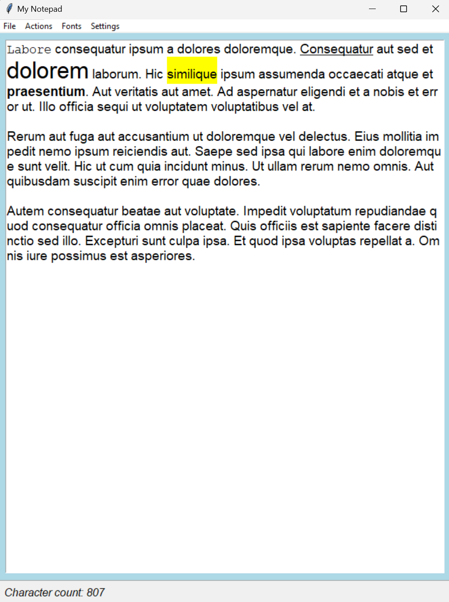

<h1 align="center">I'm Ilham, Nice to meet you </h1>
<h3 align="center">🖥️ A passionate student programmer 🖥️</h3>

### 📫 My contacts: 

Gmail: ilhamteh118@gmail.com

LinkedIn: https://www.linkedin.com/in/ilham-t-b8a136306

### 🌟 Languages I've used:

  
  
  
  
  
  
  
  
  

### 💡 Technologies/Tools I've worked with in the past:

  
  
  
  
  
  
  
  
  

### 🪄  My Key Skills:

###

-Reverse engineering

-Willing to learn/Quick learner

-Open-minded

-Adaptability

-Commitment

---

### 🛰️  My Projects:

### [1. Python Notepad:](https://github.com/IlhamIslahuddin/Python-Notepad) | `tkinter` `Application` `Offline`

This notepad marks my first tkinter project. It was one of the first times I could manipulate my own GUI and create a proper application so I looked forward to every chance I got to improve the notepad and add more features.

Key features:

-Character counter

-Mini drawable canvas

-Large selection of fonts to try

-Can save and load text files

-Mini To-do list

 

### [2. Python Clock](https://github.com/IlhamIslahuddin/Python-Clock) | `tkinter` `Application` `Offline` `Time`

This is a simple take on clock apps on phones and PCs. It includes a stopwatch, timer and the current time and date. I like to take simple apps and adapt them in my own way or explore how they could have been made.

Key features:

-Current time and date

-Timer

-Stopwatch

